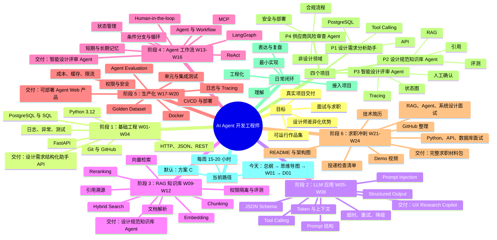

# AI Agent Career Roadmap 思维导图

```mermaid
mindmap
  root((AI Agent 开发工程师))
    目标
      真实项目交付
      可运行作品集
      面试与求职
      设计师差异化优势
    阶段 1：基础工程 W01-W04
      Python 3.12
      Git 与 GitHub
      HTTP、JSON、REST
      FastAPI
      PostgreSQL 与 SQL
      日志、异常、测试
      交付：设计需求结构化助手 API
    阶段 2：LLM 应用 W05-W08
      Token 与上下文
      Prompt 结构
      Structured Output
      JSON Schema
      Tool Calling
      超时、重试、降级
      Prompt Injection
      交付：UX Research Copilot
    阶段 3：RAG 知识库 W09-W12
      文档解析
      Chunking
      Embedding
      向量检索
      Hybrid Search
      Reranking
      引用溯源
      权限隔离与评测
      交付：设计规范知识库 Agent
    阶段 4：Agent 工作流 W13-W16
      Agent 与 Workflow
      ReAct
      状态管理
      条件分支与循环
      LangGraph
      短期与长期记忆
      Human-in-the-loop
      MCP
      交付：智能设计评审 Agent
    阶段 5：生产化 W17-W20
      单元与集成测试
      Golden Dataset
      Agent Evaluation
      日志与 Tracing
      成本、缓存、限流
      权限与安全
      Docker
      CI/CD 与部署
      交付：可部署 Agent Web 产品
    阶段 6：求职冲刺 W21-W24
      README 与架构图
      GitHub 整理
      Demo 视频
      Python、API、数据库面试
      RAG、Agent、系统设计面试
      技术简历
      投递检查清单
      交付：完整求职材料包
    四个项目
      P1 设计需求分析助手
        API
        Tool Calling
        PostgreSQL
      P2 设计规范知识库 Agent
        RAG
        引用
        评测
      P3 智能设计评审 Agent
        状态图
        人工确认
        Tracing
      P4 供应商风险审查 Agent
        非设计领域
        合规流程
        安全与部署
    日常闭环
      理解
      最小实现
      接入项目
      工程化
      表达与复盘
    当前路径
      默认：方案 C
      每周 15-20 小时
      今天：总纲 → 思维导图 → W01 → D01
```
