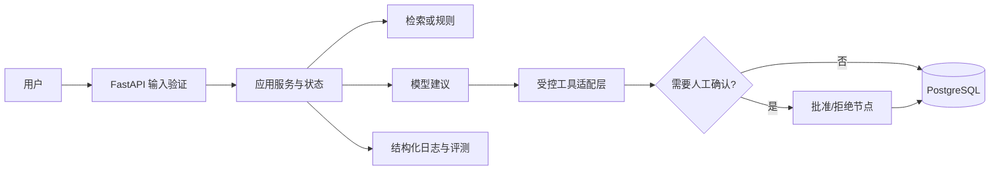

# 设计规范知识库 Agent：架构说明

## 架构目标

架构目标是将用户输入、确定性验证、模型/检索建议、工具调用和人工批准隔离为可测试组件。该项目的技术栈建议为：FastAPI、PostgreSQL、向量检索、RAG 评测、Docker。

## 组件与责任

| 组件 | 责任 | 不应承担的责任 |
|---|---|---|
| API 层 | 认证入口、请求验证、响应契约 | 直接拼接数据库 SQL 或存放模型密钥 |
| 应用服务 | 编排用例、事务边界、状态转换 | 依赖具体 Web 框架细节 |
| Agent/检索层 | 受控推理、检索、工具选择 | 直接执行未批准的外部副作用 |
| 工具适配层 | 参数验证、超时、重试、审计 | 绕开权限和人工确认 |
| 数据层 | 持久化业务状态、评测集、审计摘要 | 记录原始密钥或敏感提示词 |
| 观测层 | 日志、指标、追踪、成本 | 替代业务校验 |

## 数据与控制流

## 关键边界

1. 模型只能提出工具调用意图，应用代码负责 Schema 校验、权限验证和实际执行。
2. 检索结果需要带来源标识；生成内容不得伪造引用。
3. 高影响操作默认需要人工确认，并记录批准者、时间与依据。
4. 密钥只存在于部署环境变量或秘密管理系统中；日志默认脱敏。

## 教学版与生产版

教学版使用本地示例数据、同步调用和最小日志，目的是学习组件边界。生产版需要认证、限流、队列/超时、持久化检查点、数据隔离、监控告警、备份与回滚。

## 参考资源索引

[1]: https://docs.python.org/3/ "Python 3 Documentation"
[2]: https://fastapi.tiangolo.com/ "FastAPI Documentation"
[3]: https://www.postgresql.org/docs/ "PostgreSQL Documentation"
[4]: https://docs.docker.com/ "Docker Documentation"
[5]: https://git-scm.com/doc "Git Documentation"
[6]: https://developers.openai.com/api/docs/guides/function-calling "OpenAI Function Calling Guide"
[7]: https://developers.openai.com/api/docs/guides/structured-outputs "OpenAI Structured Outputs Guide"
[8]: https://docs.langchain.com/oss/python/langgraph/overview "LangGraph Overview"
[9]: https://modelcontextprotocol.io/ "Model Context Protocol Specification"
[10]: https://owasp.org/www-project-top-10-for-large-language-model-applications/ "OWASP Top 10 for LLM Applications"

