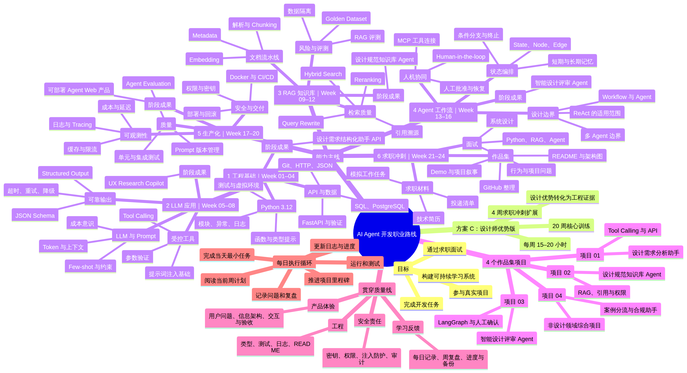

# AI Agent 开发职业路线：整体思维导图

这张图用于在开始每周任务前快速定位自己：**你正在建立哪项能力、它连接哪个项目、最终如何转化为求职证据。**

## 阅读方式

从中心向外看：先看“目标”和“方案 C”，再沿着“能力主线”查看六个连续阶段。之后查看“4 个作品集项目”，确认每一阶段都会沉淀可展示成果；最后用“贯穿质量线”和“每日执行循环”保证学习不会停留在概念或原型层面。

| 当你想判断…… | 看图中的分支 |
|---|---|
| 本周为什么要学这些内容？ | `能力主线` 中对应的 Week 范围与阶段成果。 |
| 这一能力要落在哪个项目？ | `4 个作品集项目` 与各阶段成果。 |
| 如何避免只会调用模型？ | `贯穿质量线`：工程、产品体验、安全责任与学习反馈。 |
| 每天如何不迷失？ | `每日执行循环`：周计划 → 最小任务 → 测试 → 记录 → 复盘。 |
| 如何形成求职优势？ | `求职冲刺` 和“设计优势转化为工程证据”。 |

## 可编辑版本

- [Mermaid 思维导图源文件](LEARNING_MINDMAP.mmd)：适合用支持 Mermaid 的编辑器继续调整节点。
- [学习大纲](LEARNING_OUTLINE.md)：适合阅读每个阶段的详细能力结构、项目证据和自检问题。
- [总目录](../INDEX.md)：适合从整体导航进入当天、当周、项目、知识库或求职材料。

> 当你感到方向不清时，不要试图一次完成整张图。只选择当前阶段的一个节点，并回到本周 `WEEK_PLAN.md` 中完成最小可验证任务。
