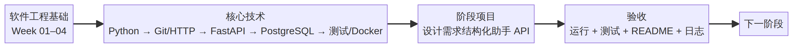

# 阶段 1：软件工程基础 学习地图

- 周次：Week 01–04
- 核心技术：Python → Git/HTTP → FastAPI → PostgreSQL → 测试/Docker
- 阶段项目：设计需求结构化助手 API
- 验收：可以运行、具备正常与失败验证、README 与学习日志已更新。

可编辑源文件：[STAGE_01_MAP.mmd](STAGE_01_MAP.mmd)。
