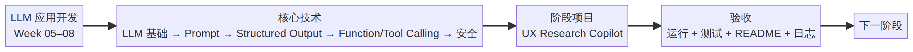

# 阶段 2：LLM 应用开发 学习地图

- 周次：Week 05–08
- 核心技术：LLM 基础 → Prompt → Structured Output → Function/Tool Calling → 安全
- 阶段项目：UX Research Copilot
- 验收：可以运行、具备正常与失败验证、README 与学习日志已更新。

可编辑源文件：[STAGE_02_MAP.mmd](STAGE_02_MAP.mmd)。
