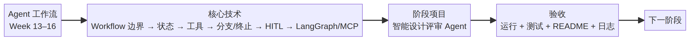

# 阶段 4：Agent 工作流 学习地图

- 周次：Week 13–16
- 核心技术：Workflow 边界 → 状态 → 工具 → 分支/终止 → HITL → LangGraph/MCP
- 阶段项目：智能设计评审 Agent
- 验收：可以运行、具备正常与失败验证、README 与学习日志已更新。

可编辑源文件：[STAGE_04_MAP.mmd](STAGE_04_MAP.mmd)。
